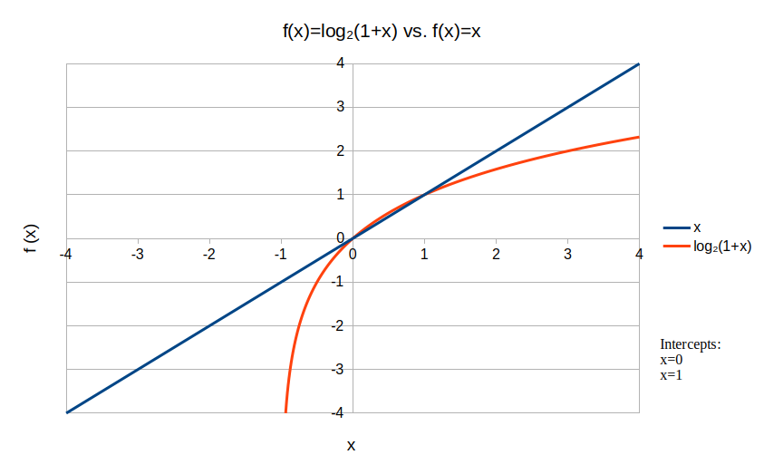
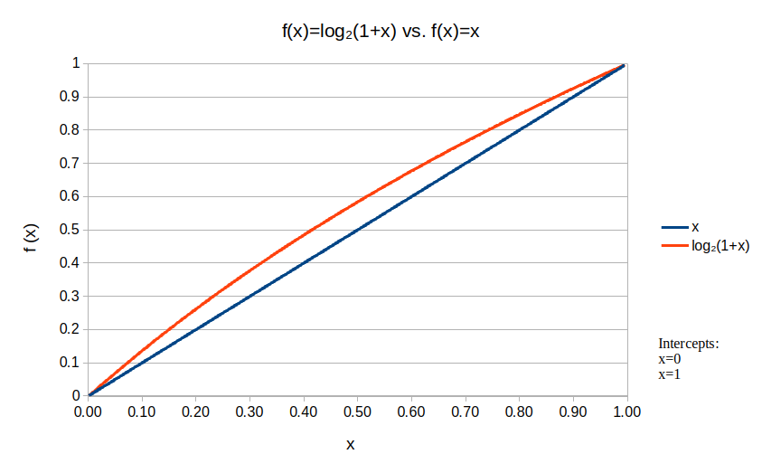
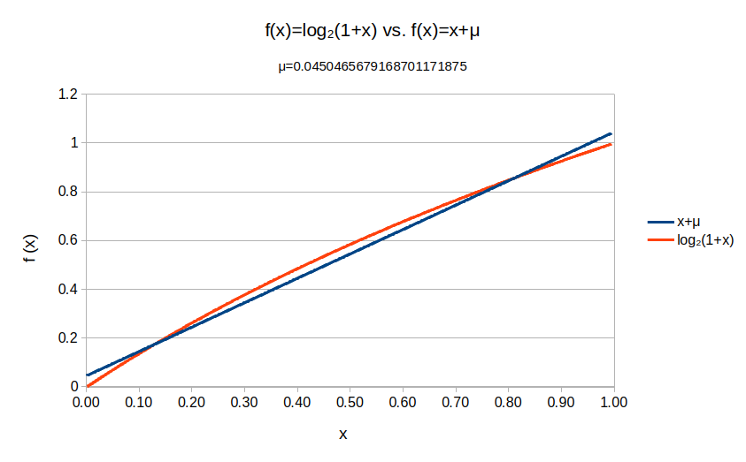

<H1>Analysis of the Quake-III-Areana Fast Inverse Square Root</H1>
<H2>Overview</H2>

The famous quake3 algorithm is an approximation of the inverse square root of a number x (where x is a positive real number). 

$$f(x) = {1 \over \sqrt{x}}$$
$$\\{x \in \mathbb{R} \mid x > 0\\}$$

<H2>Computer Graphics Background</H2>

<H2>Key Concepts</H2>
  <ol>
    <li>Normalized numbers in IEEE 754.</li>
    <li>Piecewise linear approximation.</li>
    <li>Bit manipulation in the C-language.</li>
    <li>Take advantage of constraints (input will always be positive and the result will always be between 0 and 1).</li>
  </ol>

<H3>IEEE-754</H3>
  
A single precision float in IEEE-754 (also called binary32) is defined in the table below:
  

<!--  -->
<table class="custom-table">
  <tr>
    <td></td>
    <td style="border-left: 1px solid;">Sign Bit (1-bit)</td>
    <td colspan="8"style="text-align:center;
                          border-left: 1px solid;">
        Exponent (8-bit)  
    </td>
    <td colspan="23" style="text-align:center;
                            border-left: 1px solid;
                            border-right: 1px solid;
                            ">
        Mantissa (23-bit)</td>
  </tr>
  <tr>
    <td>Bit Position</td>
    <td>31 (MSB)</td>
    <td>30</td>
    <td>29</td>
    <td>28</td>
    <td>27</td>
    <td>26</td>
    <td>25</td>
    <td>24</td>
    <td>23</td>
    <td>22</td>
    <td>21</td>
    <td>20</td>
    <td>19</td>
    <td>18</td>
    <td>17</td>
    <td>16</td>
    <td>15</td>
    <td>14</td>
    <td>13</td>
    <td>12</td>
    <td>11</td>
    <td>10</td>
    <td>9</td>
    <td>8</td>
    <td>7</td>
    <td>6</td>
    <td>5</td>
    <td>4</td>
    <td>3</td>
    <td>2</td>
    <td>1</td>
    <td>0 (LSB)</td>
  </tr>
  <tr>
    <td>Decimal Range</td>
    <td style="text-align:center; border-left: 1px solid;"> 0 to 1 (1-bit)</td>
    <td colspan="8" style="text-align:center; border-left: 1px solid;">
        0 to 255 (8-bit unsigned number)  
        [255 reserved for -infinity, infinity, NaN]
    </td>
    <td colspan="23" style="text-align:center; border-left: 1px solid; border-right: 1px solid;">
        0 to 8388607 (23-bit unsigned number)
    </td>
  </tr>
</table>

<H4>How to interpret a single precision float (32-bit) in IEEE-754:</H4>
  
The value stored in the 32-bit memory does not represent the final decimal float. The sign, exponent and mantissa stored must be interpreted as the standard defines. The equation is as follows:  

  $$float_{10}= (-1)^{Sign} * (1 + {Mantissa\over 2^{23} } ) * 2^{Exponent-Bias}$$
  

<H4>Offset Binary Notation in IEEE-754:</H4>
  
In IEEE-754, the exponent is interpreted differently than it is stored. The standard uses a "bias" to interpret the stored exponent value. The bias essentially makes the value signed, splitting the range into negative and positive values. So for a 32-bit float, the 8-bit exponent has it's decimal range is shifted from (0 to 255) to (-126 to 127). This offset is also referred to as "excess-127". Just remember that the offset changes depending on the size of the float and therefore the number of bits available to the exponent. For example, a 64-bit float would use excess-1023. This is the equation to find the bias:
  

  $$ bias = 2^{bits-1}-1$$

  
where <i>bits</i> is the available number of bits to the exponent

  

  Moreover, the standard reserves 0 and 255 for special cases (0, -inf, +inf, NaN). This affects the range of the possible unsigned integers to go from (0, 255) to (1, 254). We can represent the decimal range of possible integers as follows:

  $$ \\{1,\space 2^{bits}-2\\} $$
  Then subtract the bias:
  $$ \\{1-bias,\space (2^{bits}-2) - bias\\} $$
  which simplifies to:
  $$ \\{1-bias,\space bias\\} $$

  The standard was designed with this bias for a few reasons:
  

  <ol type="1">
    <li>"If you use exponents to show both integer (n >= 0) and fractional (n < 0) values you have the problem that you need one exponent for 2^0 = 1. So the remaining range is odd, giving you either the choice of choosing the bigger range for fractions or for integers. For single precision we have 256 values, 255 without the 0 exponent. Now IEEE754 reserved the highest exponent (255) for special values: +- Infinity and NaNs (Not a Number) to indicate failure. So we are back to even numbers again (254 for both sides, integer and fractional) but with a lower bias."<a href="#references">[2]</a></li>
    <li>"The second reason is gradual underflow. The Standard declares that normally all numbers are normalized, meaning that the exponent indicates the position of the first bit. To increase the number of bits the first bit is normally not set but assumed (hidden bit): The first bit after the exponent bit is the second bit of the number, the first is always a binary 1. If you enforce normalization you encounter the problem that you cannot encode zero and even if you encode zero as special value, the numerical accuracy is hampered. +-Infinity (the highest exponent) makes it clear that something is wrong, but underflow to zero for too small numbers is perfectly normal and therefore easily to overlook as a possible problem. So Kahan, the designer of the standard, decided that denormalized numbers or subnormals should be introduced and they should include 1/MAX_FLOAT."<a href="#references">[2]</a></li>
    <li> To allow faster comparisons between floats. The exponent must allow for negative and positive values. However, adding a sign bit using two's compliment representation would make comparisons slower because you need to consider the sign bit and potentially perform a subtraction operation to compare order. A sign bit would also reduce the range of possible exponent values. With an offset binary, your lowest value starts at zero and increases normally in binary, so binary comparisons are fast and lexicographical.<a href="#references">[3]</a> Additionally, when comparing equality of two floats, the exponent will be checked before the mantissa. This means you can save time checking equality if the exponents do not match.</li>
    <li> Why not add another sign bit that is separate like the mantissa? I believe this is because you would lose another bit of accuracy in the mantissa, which is prioritized over the exponent range.</li>
  </ol>

  
While it is not necessary to understand the entire IEEE-754 standard for this algorithm, it is necessary to understand the bit representation to help us understand the mathematical approximations in the next section. Specifically, the bit representations of the mantissa and exponent. Next we will look at how we go from: 

  $$ bit \space representation_{10} = (1 + {Mantissa\over 2^{23} } ) * 2^{Exponent-Bias} $$

  to:

  $$ log_{2}(bit\space representation_{10}) \approx {(M + 2^{23}*E)} $$

  <table>
    <tr>
      <td>31</td>
      <td style="color: red;">30</td>
      <td style="color: red;">29</td>
      <td style="color: red;">28</td>
      <td style="color: red;">27</td>
      <td style="color: red;">26</td>
      <td style="color: red;">25</td>
      <td style="color: red;">24</td>
      <td style="color: red;">23</td>
      <td style="color: teal;">22</td>
      <td style="color: teal;">21</td>
      <td style="color: teal;">20</td>
      <td style="color: teal;">19</td>
      <td style="color: teal;">18</td>
      <td style="color: teal;">17</td>
      <td style="color: teal;">16</td>
      <td style="color: teal;">15</td>
      <td style="color: teal;">14</td>
      <td style="color: teal;">13</td>
      <td style="color: teal;">12</td>
      <td style="color: teal;">11</td>
      <td style="color: teal;">10</td>
      <td style="color: teal;">9</td>
      <td style="color: teal;">8</td>
      <td style="color: teal;">7</td>
      <td style="color: teal;">6</td>
      <td style="color: teal;">5</td>
      <td style="color: teal;">4</td>
      <td style="color: teal;">3</td>
      <td style="color: teal;">2</td>
      <td style="color: teal;">1</td>
      <td style="color: teal;">0</td>
    </tr>
    <tr>
      <td></td>
      <td colspan="8" style="color: red;">2^23 * E (E is bit-shifted by 23) </td>
      <td colspan="23" style="color: teal; text-align: center;">M</td>
    </tr>
    <tr>
    </tr>
  </table>

<H3>The Mathematical Approximation:</H3>
  
The most impressive part of this algorithm is the mathematical intuition behind it. There are two major intuitions. One is a piecewise linear approximation shown below.

  $$ log_{2}(1 + x) \approx x $$
  $$\\{x \in \mathbb{R} \mid 0 \leq x \leq 1\\}$$

  

    
     
    <figcaption>
      The piecewise approximation (zoomed out).
    </figcaption>
  

   

  
In a later <a href="#cfactor">section</a>, we will discuss a correction factor &#956 that is added to improve this approximation. For now, just know that we can represent the approximation as:

  $$ log_{2}(1 + x) \approx x+\mu $$
  $$\\{x \in \mathbb{R} \mid 0 \leq x \leq 1\\}$$

  
The other intuition is the realization that the bit representation for storing a float in IEEE-754 also represents the base-2 logarithm of the same number with some constants. Note, the constants are not part of the standard or stored in the float, they must be derived and added into the approximation later on. 

  
  $$ log_{2}(x) \approx \underbrace{A}_{constant}*\underbrace{(M + 2^{23}*E)}_{bit\space representation} + \underbrace{B}_{constant}+ \underbrace{\mu}_{correction factor} $$

  
Part of the reason why this algorithm is famous is because of the mystery surrounding which intuition came first. Was it the approximation or the bit representation. From a mathematical perspective, you can't derive the bit representation without the approximation. The counterargument is how would someone even know to look for this piecewise approximation without understanding that the IEEE bit representation is the log(x) obfuscated by some constants. Only the person(s) who created the algorithm can answer that, but it is actually still unclear who that is. Most likely, they chose the mathematical perspective and tried to eliminate the square root term first, found the approximation, and then found the connection to the bit representation. This is what Nemean's approach was when covering this algorithm, and it does appear the most likely.<a href="#references">[1]</a> 

  
Now lets dive into the math behind this process. We will start by taking the logarithm our IEEE-754 float formula from earlier and then apply our approximation. Note, we will ignore the sign bit since the log of a negative number would produce a complex part and, as we will learn later on, doesn't matter because we bit shift the sign bit away anyways. So our starting bit representation is just the mantissa and exponent. Also, the following equations in this section will be for a 32-bit float, so the exponent bias is 127 and the mantissa is 23 bits in length.

  $$ x = (1 + {M\over 2^{Mantissa\space bits} }) * 2^{E-Bias} $$
  $$ x = (1 + {M\over 2^{23} }) * 2^{E-127} $$
  $$ log_{2}(x) = log_{2}((1 + {M\over 2^{23}}) * 2^{E-127}) $$
  $$ log_{2}(x) = log_{2}(1 + {M\over 2^{23}}) + log_{2}(2^{E-127}) $$
  $$ log_{2}(x) = log_{2}(1 + {M\over 2^{23}}) + E-127 $$
  $$ \rightarrow insert\space approximation:\space log_{2}(1 + x) \approx x + \mu$$
  $$ log_{2}(x) \approx {M\over 2^{23}} + \mu + E-127 $$
  $$ log_{2}(x) \approx {M\over 2^{23}} + E + \mu -127 $$
  $$ \boxed{log_{2}(x) \approx {1\over 2^{23}} (M + 2^{23}*E) + \mu -127} $$

  
Now that the piecewise approximation is integrated into the IEEE-754 float formula, it is assumed the creators then substituted this into the inverse square root. Again, we take the log of both sides of our equation and the substitute the approximation. 

  $$ y = {1 \over \sqrt{x}} $$
  $$ log_{2}(y) = log_{2}({1\over \sqrt{x}}) $$
  $$ log_{2}(y) = -{1 \over 2} log_{2}(x) $$
  $$ \rightarrow insert\space approximation:\space log_{2}(x) \approx {1\over 2^{23}} (M + 2^{23}*E) + \mu -127 $$
  $$ {1\over 2^{23}}{(M_{y}+2^{23}*E_{y})}+\mu - 127 \approx -{1 \over 2}({1\over 2^{23}}{(M_{x}+2^{23}*E_{x})}+\mu - 127) $$
  $$ {1\over 2^{23}}{(M_{y}+2^{23}*E_{y})}+\mu - 127 \approx -{1\over 2^{24}}(M_{x}+2^{23}*E_{x})-{{1\over 2} \mu} + {127\over 2} $$
  $$ {1\over 2^{23}}{(M_{y}+2^{23}*E_{y})} \approx -{1\over 2^{24}}(M_{x}+2^{23}*E_{x})-{{3\over 2}\mu} + {381\over 2} $$
  $$ {(M_{y}+2^{23}*E_{y})} \approx -{2^{23}\over 2^{24}}(M_{x}+2^{23}*E_{x})-{2^{23}{3\over 2} \mu} + 2^{23}{381\over 2} $$
  $$ {(M_{y}+2^{23}*E_{y})} \approx -{1\over 2}(M_{x}+2^{23}*E_{x})+{2^{23}(-{3\over 2} \mu} + {381\over 2}) $$
  $$ {(M_{y}+2^{23}*E_{y})} \approx -{1\over 2}(M_{x}+2^{23}*E_{x})+{3\over 2}{2^{23}}(127-\mu ) $$
  $$ \boxed{{(M_{y}+2^{23}*E_{y})} \approx {3\over 2}{2^{23}}(127-\mu )-{1\over 2} * (M_{x}+2^{23}*E_{x})} $$

  $$ \underbrace{(M_{y}+2^{23}*E_{y})}_{output,\space bit\space representation} \approx \underbrace{{3\over 2}{2^{23}}(127-\mu)}_{magic\space number}-\underbrace{{1\over 2} * (M_{x}+2^{23}*E_{x})}_{halved\space input,\space bit\space representation\space} $$

  
It is now possible to understand why the algorithm has this line of code:

  $$ \underbrace{i}_{output} = \underbrace{0x5f3759df}_{magic\space number} - \underbrace{(i >> 1)}_{halved\space input }; $$

<H4 id="cfactor">Correction Factor & Magic Number:</H4>
  
The creators knew that while the piecewise approximation wasn't the most accurate, it was fast because it did not involve any operations other than adding or multiplying some constants later on in the calculations. Looking at the vanilla approximation below, you can see the approximation is not great in between 0 and 1.
  

  

    
     
    <figcaption>
      The piecewise approximation.
    </figcaption>
  

   

  
To reduce the error across all values between 0 and 1, the creators added a correction factor &#956 to offset x. This reduces average error while keeping complexity low (addition/subtraction are fast operations).
  

  
 
    
     
    <figcaption>
      The original magic number of 0x5f3759df (meaning &#956=0.04504...)
    </figcaption>
  

   

  
The magic number that is found in the algorithm (0x5f3759df) is dependent on the correction factor &#956 chosen to offset the piecewise linear approximation. If we want to know the original correction value used by creators, we can solve for &#956 using the magic number.

  $$ magic\space number = {3\over2} * 2^{Mantissa\space bits} * (bias-\mu) $$
  $$ 0x5f3759df = {3\over2} * 2^{23} * (127-\mu) $$
  $$ 1597463007 = {3\over2} * 2^{23} * (127-\mu) $$
  $$ 1597463007 = 1598029824-12582912\mu $$
  $$ -12582912\mu = −566817 $$
  $$ -\mu = {−566817\over-12582912} $$
  $$ \mu = {188939\over4194304} $$
  $$ \boxed{\mu = 0.0450465679168701171875} $$

  
It is still speculation as to whether this value for &#956 was decided from trial and error or calculated somehow. I would also like to point out that in Nemean's youtube video, he stated that the value was 0.043, which I suspect was just a calculation or rounding error. <a href="#references">[1]</a> Additionally, the &#956 value used in the algorithm is not the best if you are trying to minimize relative error. As we will see in another section <a href="#best_constant">(Deriving the best constant)</a>, a paper published by Chris Lomont in 2003 compares maximal relative error of the original magic number and a derived magic number that minimizes maximal relative error.

<H3>Bit Manipulation:</H3>

<H2>Example</H2>

<H2>Results</H2>
<H3>Percent Difference:</H3>
<H3>Complexity Difference:</H3>
<H3 id="best_constant">Deriving the best constant (0x5F375A86):</H3>
<H3>Does this work with 64 Bits?:</H3>

<H2>Conclusion & Relevance Today</H2>

<H2 id="references">References</H2>
  <ol>
    <li>https://www.youtube.com/watch?v=p8u_k2LIZyo</li>
    <li>https://stackoverflow.com/questions/8909841/why-does-the-ieee-754-standard-use-a-127-bias</li>
    <li>https://stackoverflow.com/questions/19864749/why-do-we-bias-the-exponent-of-a-floating-point-number</li>
    <li>https://lomont.org/papers/2003/InvSqrt.pdf</li>
  </ol>